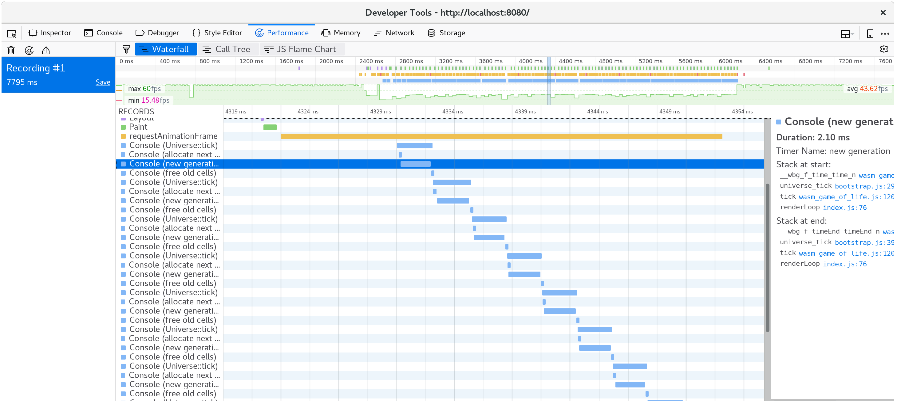

# 时间分析

在本章中，我们将改进 Game of Life 实现的性能。我们将使用时间分析来指导我们的工作。

继续之前，自己熟悉下[时间分析 Rust 和 WebAssembly 代码的可用工具](../reference/time-profiling.zh.md)。

## 使用`window.performance.now`函数，创建秒数时间器

当我们研究如何加速我们的生命游戏渲染时，这个 FPS 计时器将非常有用。

我们首先添加一个`fps`对象到`wasm-game-of-life/www/index.js`：

```js
const fps = new class {
  constructor() {
    this.fps = document.getElementById('fps');
    this.frames = [];
    this.lastFrameTimeStamp = performance.now();
  }

  render() {
    // Convert the delta time since the last frame render into a measure
    // of frames per second.
    const now = performance.now();
    const delta = now - this.lastFrameTimeStamp;
    this.lastFrameTimeStamp = now;
    const fps = (1 / delta) * 1000;

    // Save only the latest 100 timings.
    this.frames.push(fps);
    if (this.frames.length > 100) {
      this.frames.shift();
    }

    // Find the max, min, and mean of our 100 latest timings.
    let min = Infinity;
    let max = -Infinity;
    let sum = 0;
    for (let i = 0; i < this.frames.length; i++) {
      sum += this.frames[i];
      min = Math.min(this.frames[i], min);
      max = Math.max(this.frames[i], max);
    }
    let mean = sum / this.frames.length;

    // Render the statistics.
    this.fps.textContent = `
Frames per Second:
         latest = ${Math.round(fps)}
avg of last 100 = ${Math.round(mean)}
min of last 100 = ${Math.round(min)}
max of last 100 = ${Math.round(max)}
`.trim();
  }
}();
```

接着，在每次`renderLoop`迭代时，我们调用给`fps` `render`函数：

```js
const renderLoop = () => {
  fps.render(); //新

  universe.tick();
  drawGrid();
  drawCells();

  animationId = requestAnimationFrame(renderLoop);
};
```

最后，别忘了添加`fps`元素到`wasm-game-of-life/www/index.html`，就在`<canvas>`上面：

```html
<div id="fps"></div>
```

并添加更好的 CSS 其格式：

```css
#fps {
  white-space: pre;
  font-family: monospace;
}
```

瞧！刷新[http://localhost:8080](http://localhost:8080)，现在我们有一个 FPS 计数器！

[perf-now]: https://developer.mozilla.org/en-US/docs/Web/API/Performance/now

### 用`console.time`和`console.timeEnd`计时每个`Universe::tick`

需要测量每次`Universe::tick`调用的时间，我们可以使用`console.time`和`console.timeEnd`，通过`web-sys`箱。

首先，在`wasm-game-of-life/Cargo.toml`添加`web-sys`作为依赖：

```toml
[dependencies.web-sys]
version = "0.3"
features = [
  "console",
]
```

因为每个`console.time`调用都应该有一个对应的`console.timeEnd`调用，方便将它们包装为一个[RAII][]类型：

```rust
extern crate web_sys;
use web_sys::console;

pub struct Timer<'a> {
    name: &'a str,
}

impl<'a> Timer<'a> {
    pub fn new(name: &'a str) -> Timer<'a> {
        console::time_with_label(name);
        Timer { name }
    }
}

impl<'a> Drop for Timer<'a> {
    fn drop(&mut self) {
        console::time_end_with_label(self.name);
    }
}
```

然后，将此代码段添加到方法的顶部，我们就可以计算每个`Universe::tick`时间：

```rust
let _timer = Timer::new("Universe::tick");
```

每次`Universe::tick`调用的时间，现在会在控制台上记录了：

[](../images/game-of-life/console-time.png)

另外，一对`console.time`和`console.timeEnd`将显示在浏览器分析器的“时间轴”或“瀑布”视图中：pp[](../images/game-of-life/console-time-in-profiler.png)

[raii]: https://en.wikipedia.org/wiki/Resource_acquisition_is_initialization

## 壮大我们的生命游戏宇宙

> ⚠️ 本节使用 Firefox 的示例屏幕截图。虽然所有现代浏览器都有类似的工具，但使用不同的开发人员工具可能会有轻微的细微差别。您提取的配置信息基本相同，但在您使用途中，可能会因您看到的视图和不同工具的命名而有所不同。

如果我们让我们的生命游戏世界更大，会发生什么？用 128 x 128 宇宙替换 64 x 64 宇宙（通过修改`Universe::new`在`wasm-game-of-life/src/lib.rs`）导致 FPS 在我的机器上从平滑的 60 下降到波动的 40-ish。

如果我们记录一个配置文件(profile)并查看瀑布视图，我们会看到每个动画帧花费超过 20 毫秒。回想一下，每秒 60 帧的意思是，渲染帧的整个过程最多 16 毫秒。其中不仅仅是我们的 JavaScript 和 WebAssembly，还有浏览器正在做的其他事情，比如绘画。

[](../images/game-of-life/drawCells-before-waterfall.png)

如果我们看一下单个动画帧中发生的事情，我们就会看到`CanvasRenderingContext2D.fillStyle`setter 很贵！

> ⚠️ 在 Firefox 中，如果你看到一行简单地说“DOM”而不是上诉的`CanvasRenderingContext2D.fillStyle`，您可能需要在性能开发人员工具选项中打开“显示 Gecko 平台数据”选项：
>
> [](../images/game-of-life/profiler-firefox-show-gecko-platform.png)

[](../images/game-of-life/drawCells-before-flamegraph.png)

我们可以通过查看调用树的多个帧的聚合，来确认这不是异常：

[](../images/game-of-life/drawCells-before-calltree.png)

我们将近 40％的时间花在了这个 setter 上！

> ⚡ 我们可能会想这个`tick`方法是性能瓶颈，但事实并非如此。要让分析引导您的注意力，不然时间可能花在您不期望的地方。

`wasm-game-of-life/www/index.js`的`drawCells`函数里面，对每次动画帧，Universe 中的每个单元格都设置一次`fillStyle`属性：

```js
for (let row = 0; row < height; row++) {
  for (let col = 0; col < width; col++) {
    const idx = getIndex(row, col);

    ctx.fillStyle = cells[idx] === DEAD ? DEAD_COLOR : ALIVE_COLOR;

    ctx.fillRect(
      col * (CELL_SIZE + 1) + 1,
      row * (CELL_SIZE + 1) + 1,
      CELL_SIZE,
      CELL_SIZE
    );
  }
}
```

现在我们已经发现了这个`fillStyle`是如此昂贵，我们可以做些什么来避免经常设置它？我们需要改变`fillStyle`，表明单元格是活着还是死亡。如果我们设定`fillStyle = ALIVE_COLOR`，然后在一次通过，绘制完所有活单元格，然后设置`fillStyle = DEAD_COLOR`，并在另一次，绘制所有死单元格，然后到结束，我们只设置了`fillStyle`两次，而不是单元格数。

```js
// Alive cells.
ctx.fillStyle = ALIVE_COLOR;
for (let row = 0; row < height; row++) {
  for (let col = 0; col < width; col++) {
    const idx = getIndex(row, col);
    if (cells[idx] !== Cell.Alive) {
      continue;
    }

    ctx.fillRect(
      col * (CELL_SIZE + 1) + 1,
      row * (CELL_SIZE + 1) + 1,
      CELL_SIZE,
      CELL_SIZE
    );
  }
}

// Dead cells.
ctx.fillStyle = DEAD_COLOR;
for (let row = 0; row < height; row++) {
  for (let col = 0; col < width; col++) {
    const idx = getIndex(row, col);
    if (cells[idx] !== Cell.Dead) {
      continue;
    }

    ctx.fillRect(
      col * (CELL_SIZE + 1) + 1,
      row * (CELL_SIZE + 1) + 1,
      CELL_SIZE,
      CELL_SIZE
    );
  }
}
```

保存这些更改，并刷新[http://localhost:8080 /](http://localhost:8080/)后，渲染恢复到每秒平滑 60 帧。

如果我们采用另一个配置文件，我们可以看到现在每个动画帧只花费大约 10 毫秒。

[](../images/game-of-life/drawCells-after-waterfall.png)

击败罪魁祸首，我们看到了`fillStyle`成本已经消失，我们的大部分时间花在了内部的`fillRect`，其是绘制每个单元格的矩形。

[](../images/game-of-life/drawCells-after-flamegraph.png)

## 让时间更快

有些人不喜欢等待，并且，如果每个动画帧不是发生仅一次宇宙嘀嗒(tick)，而是更喜欢九次。我们可以修改`wasm-game-of-life/www/index.js`的`renderLoop`函数，这很容易做到这一点：

```js
for (let i = 0; i < 9; i++) {
  universe.tick();
}
```

在我的机器上，这使我们恢复到每秒 35 帧。不好。我们想要那个大大滴 60！

现在我们知道时间花在了`Universe::tick`，所以让我们添加一些`Timer`，用`console.time`和`console.timeEnd`调用来包装它的各个部分，然后，看看它引导我们的地方。我假设啊，是分配一个新的单元格向量(vector)，后在每次 tick，就要释放旧向量是昂贵的，占用了我们时间预算的很大一部分。

```rust
pub fn tick(&mut self) {
    let _timer = Timer::new("Universe::tick");

    let mut next = {
        let _timer = Timer::new("allocate next cells");
        self.cells.clone()
    };

    {
        let _timer = Timer::new("new generation");
        for row in 0..self.height {
            for col in 0..self.width {
                let idx = self.get_index(row, col);
                let cell = self.cells[idx];
                let live_neighbors = self.live_neighbor_count(row, col);

                let next_cell = match (cell, live_neighbors) {
                    // Rule 1: Any live cell with fewer than two live neighbours
                    // dies, as if caused by underpopulation.
                    (Cell::Alive, x) if x < 2 => Cell::Dead,
                    // Rule 2: Any live cell with two or three live neighbours
                    // lives on to the next generation.
                    (Cell::Alive, 2) | (Cell::Alive, 3) => Cell::Alive,
                    // Rule 3: Any live cell with more than three live
                    // neighbours dies, as if by overpopulation.
                    (Cell::Alive, x) if x > 3 => Cell::Dead,
                    // Rule 4: Any dead cell with exactly three live neighbours
                    // becomes a live cell, as if by reproduction.
                    (Cell::Dead, 3) => Cell::Alive,
                    // All other cells remain in the same state.
                    (otherwise, _) => otherwise,
                };

                next[idx] = next_cell;
            }
        }
    }

    let _timer = Timer::new("free old cells");
    self.cells = next;
}
```

看看时间，很明显我的假设是不正确的：绝大部分时间，实际花在计算下一代单元格上。令人惊讶的是，在每次 tick 上分配和释放向量，似乎具有可忽略的成本。分析记录是始终指导我们工作的提醒！

[](../images/game-of-life/console-time-in-universe-tick.png)

下一节需要`nightly`编译器。它是必需的，因为[测试 feature(特性) ](https://doc.rust-lang.org/unstable-book/library-features/test.html)我们准备用于基准测试。我们将安装的另一个工具是[Cargo benchcmp][benchcmp]。它是一个小实用程序，用于比较`cargo bench`生成的微基准测试。

[benchcmp]: https://github.com/BurntSushi/cargo-benchcmp

一个`#[bench]`原生代码，就做了我们 WebAssembly 正在做的事情，但我们可以使用更成熟的分析工具。这是新的`wasm-game-of-life/benches/bench.rs`：

```rust
#![feature(test)]

extern crate test;
extern crate wasm_game_of_life;

#[bench]
fn universe_ticks(b: &mut test::Bencher) {
    let mut universe = wasm_game_of_life::Universe::new();

    b.iter(|| {
        universe.tick();
    });
}
```

我们还要注释所有的`#[wasm_bindgen]`标示，和来自`Cargo.toml`的`"cdylib"`，不然，构建本机代码将失败并出现链接错误。

有了这一切，我们就可以运行了`cargo bench | tee before.txt`编译并运行我们的基准测试！`| tee before.txt`部分将从`cargo bench`中获取输出，并放入一个名为`before.txt`的文件。

```
$ cargo bench | tee before.txt
    Finished release [optimized + debuginfo] target(s) in 0.0 secs
     Running target/release/deps/wasm_game_of_life-91574dfbe2b5a124

running 0 tests

test result: ok. 0 passed; 0 failed; 0 ignored; 0 measured; 0 filtered out

     Running target/release/deps/bench-8474091a05cfa2d9

running 1 test
test universe_ticks ... bench:     664,421 ns/iter (+/- 51,926)

test result: ok. 0 passed; 0 failed; 0 ignored; 1 measured; 0 filtered out
```

这也告诉我们二进制文件的位置，我们可以再次运行基准测试，但这次是在我们的操作系统的分析器下。就我而言，我正在运行 Linux，所以[`perf`][perf]是我将使用的探查分析器：

[perf]: https://perf.wiki.kernel.org/index.php/Main_Page

```
$ perf record -g target/release/deps/bench-8474091a05cfa2d9 --bench
running 1 test
test universe_ticks ... bench:     635,061 ns/iter (+/- 38,764)

test result: ok. 0 passed; 0 failed; 0 ignored; 1 measured; 0 filtered out

[ perf record: Woken up 1 times to write data ]
[ perf record: Captured and wrote 0.178 MB perf.data (2349 samples) ]
```

用`perf report`加载配置文件，表明我们所有的时间都花在了`Universe::tick`，如预期的那样：

[](../images/game-of-life/bench-perf-report.png)

如果你按`a`，工具`perf`将注释一个函数时间中的哪些命令的花费：

[](../images/game-of-life/bench-perf-annotate.png)

这告诉我们 26.67％的时间用于求和相邻单元格的值，23.41％的时间用于获取邻居的列索引，另外 15.42％的时间用于获取邻居的行索引。在这三大最昂贵的命令中，第二和第三命令都让`div`很昂贵。这些`div`在`Universe::live_neighbor_count`实现 modulo 索引逻辑。

回想一下`wasm-game-of-life/src/lib.rs`里面的`live_neighbor_count`定义：

```rust
fn live_neighbor_count(&self, row: u32, column: u32) -> u8 {
    let mut count = 0;
    for delta_row in [self.height - 1, 0, 1].iter().cloned() {
        for delta_col in [self.width - 1, 0, 1].iter().cloned() {
            if delta_row == 0 && delta_col == 0 {
                continue;
            }

            let neighbor_row = (row + delta_row) % self.height;
            let neighbor_col = (column + delta_col) % self.width;
            let idx = self.get_index(neighbor_row, neighbor_col);
            count += self.cells[idx] as u8;
        }
    }
    count
}
```

我们使用 modulo 的原因是为了避免使代码混乱，`if`出第一行或最后一行/列的边缘情况分支。但，当我们不在宇宙的边缘`row`或`column`的时候，不需要 modulo 包裹处理，会为此最常见情况的`div`命令付出代价。相反，如果我们使用`if`出边缘情况，并展开此循环，CPU 的分支预测器*应该*可以很好地预测它。

我们改写`live_neighbor_count`，像这样：

```rust
fn live_neighbor_count(&self, row: u32, column: u32) -> u8 {
    let mut count = 0;

    let north = if row == 0 {
        self.height - 1
    } else {
        row - 1
    };

    let south = if row == self.height - 1 {
        0
    } else {
        row + 1
    };

    let west = if column == 0 {
        self.width - 1
    } else {
        column - 1
    };

    let east = if column == self.width - 1 {
        0
    } else {
        column + 1
    };

    let nw = self.get_index(north, west);
    count += self.cells[nw] as u8;

    let n = self.get_index(north, column);
    count += self.cells[n] as u8;

    let ne = self.get_index(north, east);
    count += self.cells[ne] as u8;

    let w = self.get_index(row, west);
    count += self.cells[w] as u8;

    let e = self.get_index(row, east);
    count += self.cells[e] as u8;

    let sw = self.get_index(south, west);
    count += self.cells[sw] as u8;

    let s = self.get_index(south, column);
    count += self.cells[s] as u8;

    let se = self.get_index(south, east);
    count += self.cells[se] as u8;

    count
}
```

现在让我们再次运行基准测试！这次输出到`after.txt`。

```
$ cargo bench | tee after.txt
   Compiling wasm_game_of_life v0.1.0 (file:///home/fitzgen/wasm_game_of_life)
    Finished release [optimized + debuginfo] target(s) in 0.82 secs
     Running target/release/deps/wasm_game_of_life-91574dfbe2b5a124

running 0 tests

test result: ok. 0 passed; 0 failed; 0 ignored; 0 measured; 0 filtered out

     Running target/release/deps/bench-8474091a05cfa2d9

running 1 test
test universe_ticks ... bench:      87,258 ns/iter (+/- 14,632)

test result: ok. 0 passed; 0 failed; 0 ignored; 1 measured; 0 filtered out
```

看起来好多了！我们可以看到它有多好，通过`benchcmp`工具，和比较我们之前创建的两个文本文件：

```
$ cargo benchcmp before.txt after.txt
 name            before.txt ns/iter  after.txt ns/iter  diff ns/iter   diff %  speedup
 universe_ticks  664,421             87,258                 -577,163  -86.87%   x 7.61
```

哇！7.61 倍的加速！

WebAssembly 有意映射到常见的硬件架构，但我们确实需要确保这个本机代码加速转换为 WebAssembly ，而 WebAssembly 当然也加快了速度。

让我们`wasm-pack build`，重建一下`.wasm`同并刷新[http://localhost:8080 /](http://localhost:8080/)。在我的机器上，页面再次以每秒 60 帧的速度运行，并且使用浏览器的分析器记录另一个配置文件，显示每个动画帧大约需要 10 毫秒。

成功！

[](../images/game-of-life/waterfall-after-branches-and-unrolling.png)

## 演习

- 在这一点上，下一个最低的强化是，`Universe::tick`删除分配和释放。实现单元格的双缓冲，其中`Universe`维护两个向量，从不释放它们中的任何一个，并且`tick`永远不会分配新的缓冲区。

- 从“实现生命”一章，实现替代的基于 delta 的设计，其中 Rust 代码返回，将状态更改为 JavaScript 的单元格列表。这会使渲染`<canvas>`快点？你可以实现这个设计，而不在每次 tick 上分配一个新的增量列表吗？

- 正如我们的分析向我们展示的那样，2D`<canvas>`渲染速度不是特别快。用 一个[WebGL 的][webgl]渲染器 替换 2D 画布渲染器。WebGL 版本的速度有多快？在 WebGL 渲染成为瓶颈之前，你能在多大程度上建立宇宙？

[webgl]: https://developer.mozilla.org/en-US/docs/Web/API/WebGL_API
