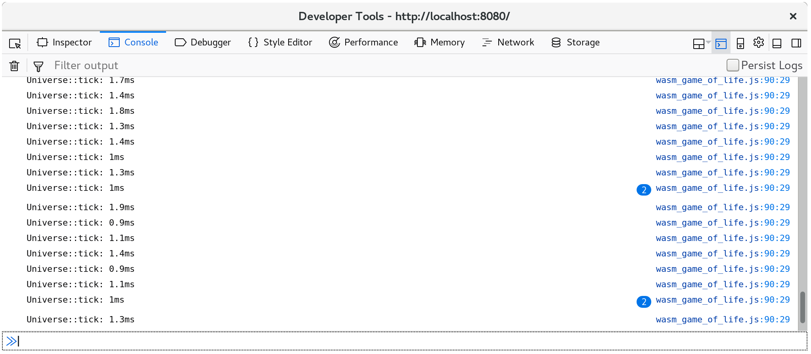

# 时间 分析

本节介绍如何分析，在使用 Rust 和 WebAssembly 的 Web 页面，目标是提高吞吐量或延迟质量。

> ⚡ 始终确保在分析时，使用的是已优化的构建版本! `wasm-pack build`默认情况下将使用优化构建.

## 可用的工具

### `window.performance.now()` 计时器

[`performance.now()`函数][perf-now]返回自加载网页以来，以毫秒为单位测量的单调时间戳.

调用`performance.now`的开销很小，因此我们可以从中创建简单的粒度测量，而不会扭曲系统其他部分的性能，并对测量造成偏差。

我们可以使用它来计时各种操作，我们可以通过[`web-sys`箱][web-sys]访问`window.performance.now()`:

```rust
extern crate web_sys;

fn now() -> f64 {
    web_sys::window()
        .expect("should have a Window")
        .performance()
        .expect("should have a Performance")
        .now()
}
```

- [`web_sys::window` 函数](https://rustwasm.github.io/wasm-bindgen/api/web_sys/fn.window.html)
- [`web_sys::Window::performance` 方法](https://rustwasm.github.io/wasm-bindgen/api/web_sys/struct.Window.html#method.performance)
- [`web_sys::Performance::now` 方法](https://rustwasm.github.io/wasm-bindgen/api/web_sys/struct.Performance.html#method.now)

[perf-now]: https://developer.mozilla.org/en-US/docs/Web/API/Performance/now

### 开发工具 分析器

所有 Web 浏览器的内置开发人员工具都包含一个分析器。这些分析器显示哪些函数花费最多时间，表现形式为可视化类型，如调用树和火焰图。

如果你[用调试符号构建][symbols]，在 wasm 二进制文件中会包含自定义部分"name"，那这些分析器应该显示 Rust 函数名称，而不是像`wasm-function[123]`这种不透明。

请注意这些分析器*并不会*显示内联函数，且由于 Rust 和 LLVM 依赖于如此大量的内联，结果可能仍然有点令人困惑。

[symbols]: ./debugging.zh.html#building-with-debug-symbols

[](../images/game-of-life/profiler-with-rust-names.png)

#### 资源

- [Firefox 开发工具 — 性能](https://developer.mozilla.org/en-US/docs/Tools/Performance)
- [Microsoft Edge 开发工具 — 性能](https://docs.microsoft.com/en-us/microsoft-edge/devtools-guide/performance)
- [Chrome DevTools JavaScript 分析器](https://developers.google.com/web/tools/chrome-devtools/rendering-tools/js-execution)

### `console.time` 和 `console.timeEnd` 函数

[`console.time`和`console.timeEnd`函数][console-time]允许您将命名操作的时间，记录到浏览器的控制台。开始时，你先调用`console.time("some operation")`，再之后调用`console.timeEnd("some operation")`，就会结束，注意命名操作的字符串标签是可选的。

您可以通过[`web-sys`箱][web-sys]直接使用这些函数:

- [`web_sys::console::time_with_label("some operation")`](https://rustwasm.github.io/wasm-bindgen/api/web_sys/console/fn.time_with_label.html)
- [`web_sys::console::time_end_with_label("some operation")`](https://rustwasm.github.io/wasm-bindgen/api/web_sys/console/fn.time_end_with_label.html)

这是截图：`console.time`在浏览器的控制台:

[](../images/game-of-life/console-time.png)

另外，`console.time`和`console.timeEnd`日志将显示在浏览器的分析器的"时间轴(timeline)"或"瀑布(waterfall)"视图中:

[](../images/game-of-life/console-time-in-profiler.png)

[console-time]: https://developer.mozilla.org/en-US/docs/Web/API/Console/time

### 使用 原生代码 `#[bench]`

我们也可以常编写`#[test]`，来影响我们操作系统的本机代码调试工具而不是在 Web 上调试，我们可以通过编写`#[bench]`函数来影响我们操作系统的本机代码分析工具.

在子目录`benches`中，写下您的基准。确保你的`crate-type`包括`"rlib"`，否则基准二进制文件将无法链接您的主 lib.

然而! 在为本机代码分析投入大量精力之前，请确保，您知道瓶颈是在 WebAssembly 中! 使用浏览器的分析器确认这一点，否则您可能会浪费时间优化，那些并不准确的代码。

#### 资源

- [使用 `perf` 分析器 on Linux](http://www.brendangregg.com/perf.html)
- [使用 the Instruments.app 分析器 on macOS](https://help.apple.com/instruments/mac/current/)
- [VTune 分析器 支持 Windows 和 Linux](https://software.intel.com/en-us/vtune)

[web-sys]: https://rustwasm.github.io/wasm-bindgen/web-sys/index.html
