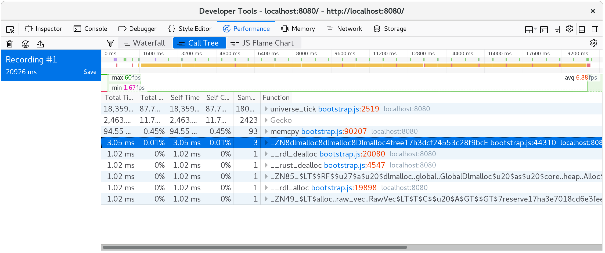

# Time Profiling

本节介绍如何使用Rust和WebAssembly来分析Web页面,其目标是提高吞吐量或延迟.

> ⚡始终确保在分析时使用优化的构建!`wasm-pack
> build`默认情况下将使用优化构建.

## Available Tools

### The `window.performance.now()` Timer

[该`performance.now()`功能][perf-now]返回自加载网页以来以毫秒为单位测量的单调时间戳.

调用`performance.now`开销很小,因此我们可以从中创建简单的粒度测量,而不会扭曲系统其他部分的性能,并对测量造成偏差.

我们可以使用它来计时各种操作,我们可以访问`window.performance.now()`通过[该`web-sys`箱][web-sys]:

```rust
extern crate web_sys;

fn now() -> f64 {
    web_sys::window()
        .expect("should have a Window")
        .performance()
        .expect("should have a Performance")
        .now()
}
```

-   [The `web_sys::window` function](https://rustwasm.github.io/wasm-bindgen/api/web_sys/fn.window.html)
-   [The `web_sys::Window::performance` method](https://rustwasm.github.io/wasm-bindgen/api/web_sys/struct.Window.html#method.performance)
-   [The `web_sys::Performance::now` method](https://rustwasm.github.io/wasm-bindgen/api/web_sys/struct.Performance.html#method.now)

[perf-now]: https://developer.mozilla.org/en-US/docs/Web/API/Performance/now

### Developer Tools Profilers

所有Web浏览器的内置开发人员工具都包含一个分析器.这些分析器显示哪些函数花费最多时间与通常类型的可视化,如调用树和火焰图.

如果你[用调试符号构建][symbols]所以"名称"自定义部分包含在wasm二进制文件中,那么这些分析器应该显示Rust函数名称而不是像`wasm-function[123]`.

请注意这些分析器*惯于*显示内联函数,由于Rust和LLVM依赖于如此大量的内联,结果可能仍然有点令人困惑.

[symbols]: ./debugging.html#building-with-debug-symbols

[](../images/game-of-life/profiler-with-rust-names.png)

#### Resources

-   [Firefox Developer Tools — Performance](https://developer.mozilla.org/en-US/docs/Tools/Performance)
-   [Microsoft Edge Developer Tools — Performance](https://docs.microsoft.com/en-us/microsoft-edge/devtools-guide/performance)
-   [Chrome DevTools JavaScript Profiler](https://developers.google.com/web/tools/chrome-devtools/rendering-tools/js-execution)

### The `console.time` and `console.timeEnd` Functions

[该`console.time`和`console.timeEnd`功能][console-time]允许您将命名操作的时间记录到浏览器的开发人员工具控制台.你打电话`console.time("some operation")`当操作开始时,并打电话`console.timeEnd("some operation")`什么时候结束命名操作的字符串标签是可选的.

您可以直接使用这些功能[该`web-sys`箱][web-sys]:

-   [`web_sys::console::time_with_label("some
    operation")`](https://rustwasm.github.io/wasm-bindgen/api/web_sys/console/fn.time_with_label.html)
-   [`web_sys::console::time_end_with_label("some
    operation")`](https://rustwasm.github.io/wasm-bindgen/api/web_sys/console/fn.time_end_with_label.html)

这是截图`console.time`登录浏览器的控制台:

[](../images/game-of-life/console-time.png)

另外,`console.time`和`console.timeEnd`日志将显示在浏览器的分析器的"时间轴"或"瀑布"视图中:

[](../images/game-of-life/console-time-in-profiler.png)

[console-time]: https://developer.mozilla.org/en-US/docs/Web/API/Console/time

### Using `#[bench]` with Native Code

我们通常也可以通过编写来利用我们操作系统的本机代码调试工具`#[test]`而不是在Web上调试,我们可以通过编写来利用我们操作系统的本机代码分析工具`#[bench]`功能.

写下您的基准`benches`你的箱子的子目录.确保你的`crate-type`包括`"rlib"`否则替补二进制文件将无法链接您的主lib.

然而!在为本机代码分析投入大量精力之前,请确保您知道瓶颈在WebAssembly中!使用浏览器的分析器确认这一点,否则您可能会浪费时间来优化不热的代码.

#### Resources

-   [Using the `perf` profiler on Linux](http://www.brendangregg.com/perf.html)
-   [Using the Instruments.app profiler on macOS](https://help.apple.com/instruments/mac/current/)
-   [The VTune profiler supports Windows and Linux](https://software.intel.com/en-us/vtune)

[web-sys]: https://rustwasm.github.io/wasm-bindgen/web-sys/index.html
